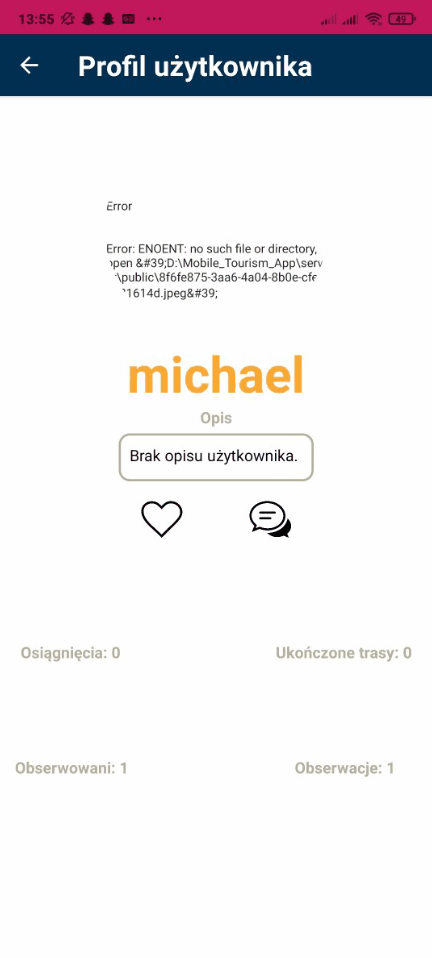

# Mobile_App_React_Native_Views
<h3>Głównie zajmowałem się front end’em w technologii React Native. Poniżej różne gofy przedstawiające widoki, powiązania oraz funkcjonalności po stronie klienta.</h3>

  
  
  
  
  
  
  
  
  
  

